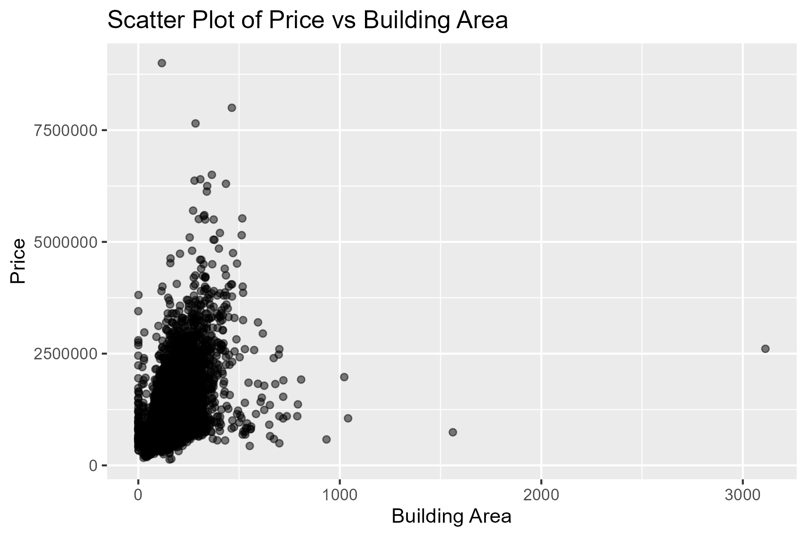
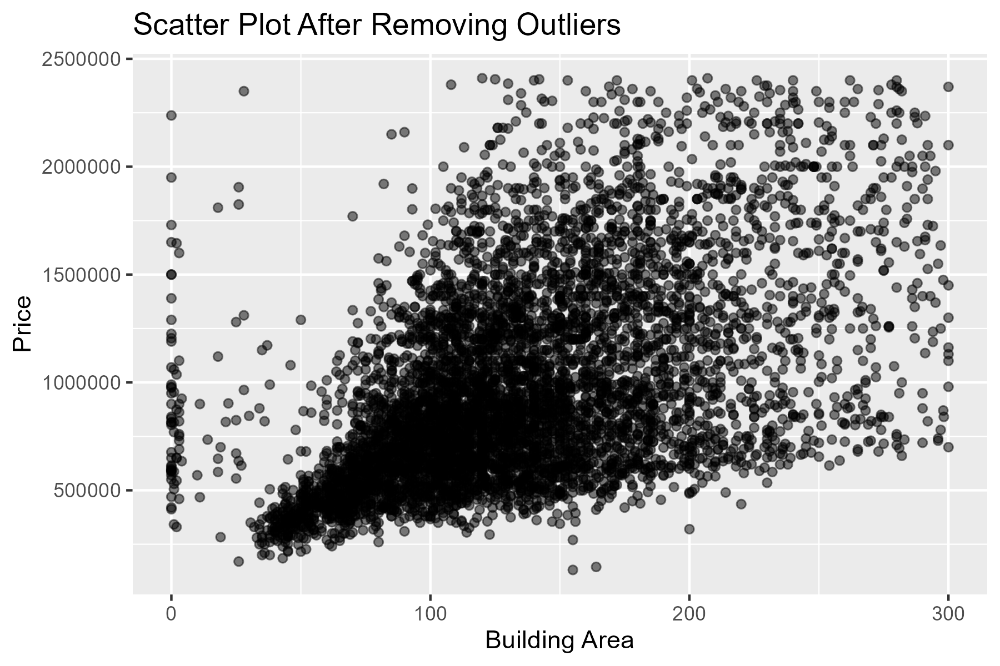
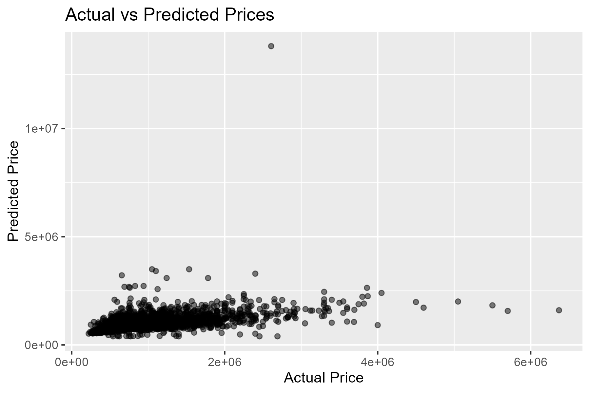
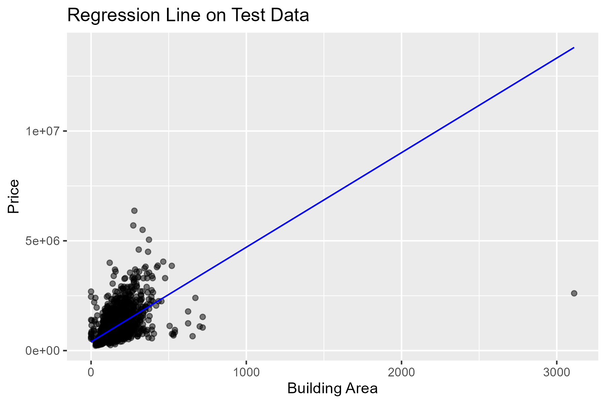

# Simple-Regression-Housing-Price
Predicting housing prices using a simple regression model in R

# Showing results

## Scatter Plot of Price vs Building Area

## Scatter Plot After Removing Outliers

## Actual vs Predicted Prices

## Regression Line on Test Data

